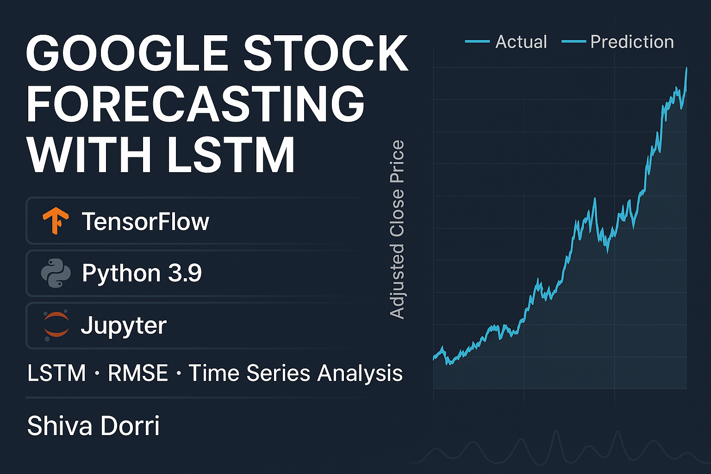

# 📈 Google Stock Price Prediction Using LSTM

  

## Project Overview
This project applies deep learning to perform **short-term stock price prediction** using Google's historical stock data from **August 2004 to December 2024**. Beyond just modeling, this project demonstrates **exploratory financial analysis**, **data-driven decision-making**, and **LSTM model optimization** for time series forecasting.

The goal is to:
- Analyze long-term and short-term price trends
- Understand volume dynamics and investor behavior
- Extract insights from technical indicators (e.g., Moving Averages)
- Build, train, and compare multiple **LSTM models** for short-term forecasting

---

## Dataset Summary
- **Source**: Downloaded via `yfinance` for Google stock (GOOGL)
- **Time Span**: August 19, 2004 to December 17, 2024
- **Frequency**: Daily (excluding weekends/holidays)

**Key columns**:
- `Close`, `Adj Close`, `Volume`
- Derived features like `SMA (10, 30, 60, 90)` and `log returns`

---

##  Key Insights from Data Analysis
- **Weekday Return Analysis**: Minimal differences across weekdays → excluded from modeling.
- **Close vs Adj Close**:
  - `Close` used for modeling
  - `Adj Close` used for visualization due to dividend/split adjustments
- **Volume**:
  - Declining as price rises → suggests maturing/stabilizing stock
  - Initial IPO years showed high trading activity
- **SMA Analysis**:
  - `SMA(10)` tracks short-term movement best
  - `SMA(30+)` gives long-term smoothing
  - Crossovers helped identify momentum shifts

---

## Why MA(10) Was Selected
- Best balance between responsiveness and noise reduction
- Helped identify short-term trends
- **Used to choose the LSTM time window (T=10)**, even though **not directly fed as a feature**
- Will consider including it explicitly in future model iterations

---

## Deep Learning Models: LSTM Family
Used `Close` price only, scaled via `StandardScaler`. Data prepared with a **T=10** sliding window for supervised learning.

###  Base Model
- LSTM(16) → Dense(1)
- 50 epochs, batch size = 16
- Designed to avoid overfitting on 5K-sized dataset

###  Tuned & Stacked Models
- LSTM(32), LSTM(64), LSTM(128)
- LSTM(64) with regularization
- LSTM(128) performed best overall

---

##  Evaluation Metrics
All models evaluated using:
- **RMSE**: Root Mean Squared Error
- **MAE**: Mean Absolute Error
- **R²**: Coefficient of Determination

### 📋 Model Performance
| Model              | RMSE    | MAE     | R²       |
|-------------------|---------|---------|----------|
| Base Model (16)   | 6.04    | 4.21    | 0.62     |
| LSTM (32)         | 5.14    | 3.61    | 0.73     |
| LSTM (64)         | 5.10    | 3.64    | 0.73     |
| LSTM (128)        | **4.87**| **3.65**| **0.75** |
| LSTM (64) - Reg   | 9.63    | 7.43    | 0.04     |

✅ **LSTM(128)** yielded the lowest RMSE and highest R².

---

##  Visual Results
- Predicted vs. Actual stock prices (train/test)
- Evaluation of learning stability with loss plots
- Visual trends aligned well with model quality

---

##  Tools & Libraries
- `yfinance` – data collection
- `pandas`, `numpy` – preprocessing & transformation
- `matplotlib`, `seaborn` , `plotly express`– visualizations
- `scikit-learn` – StandardScaler, metrics
- `tensorflow.keras` – LSTM, callbacks, optimizers

---

##  Final Thoughts
This project reflects:
- Financially-informed feature engineering
- Well-structured model comparison
- Real-world understanding of stock dynamics
- Practical application of LSTM for forecasting

---

##  Future Improvements
- Add indicators like RSI, MACD
- Explore GRU, BiLSTM, and Transformers
- Apply dropout and early stopping
- Hyperparameter tuning with KerasTuner
- Include macroeconomic/news sentiment data

---

## 👩‍💼 Author
Project developed by **Shiva Dorri** as part of her deep learning journey in financial forecasting.

---

**Techniques used**: `LSTM` `Model Comparison` `RMSE` `R²` `StandardScaler` `Sequential Modeling` `Time Series Forecasting` `Google Stock Analysis` `Deep Learning` `TensorFlow`
